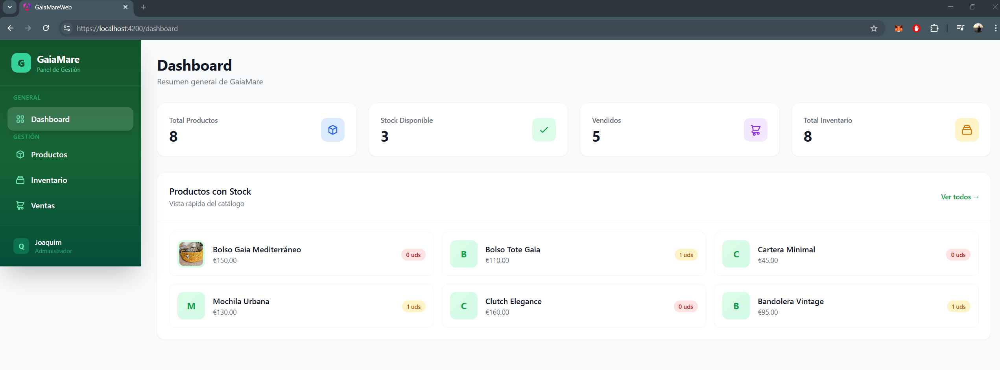
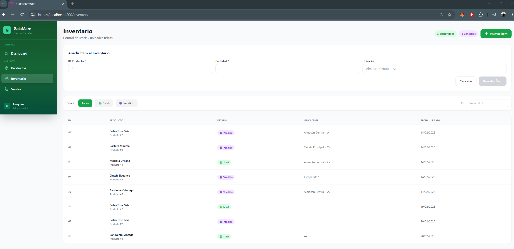
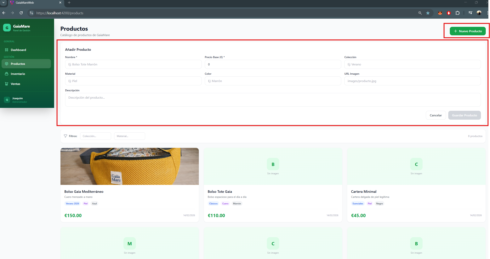
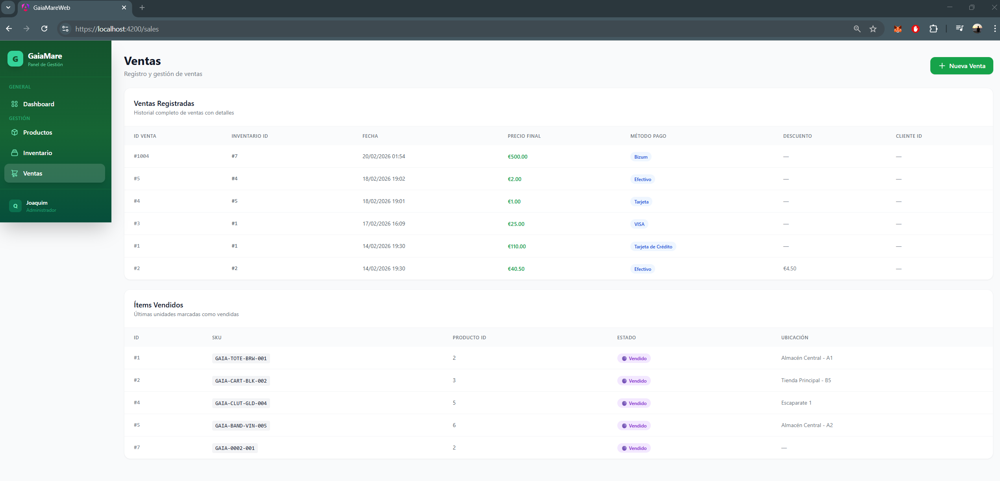
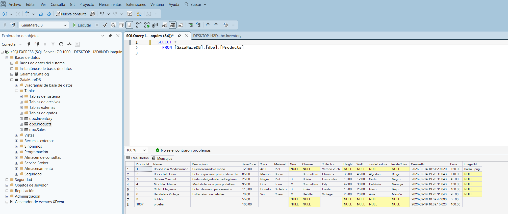

# GaiaMare - Sistema de Gestión de Inventario

Sistema completo de gestión de productos e inventario de calzado con API REST (.NET 10) y frontend web (Angular 17).


---

## 🚀 Tecnologías

### Backend (API REST)
- **.NET 10** - Framework moderno de Microsoft para aplicaciones web de alto rendimiento
- **C# 14.0** - Lenguaje orientado a objetos con características modernas (records, pattern matching, nullable)
- **ASP.NET Core Web API** - Framework para crear APIs REST con endpoints HTTP estándar
- **Entity Framework Core** - ORM (Object-Relational Mapper) con LINQ, migrations y lazy/eager loading
- **SQL Server** - Sistema de gestión de bases de datos relacional con soporte a transacciones ACID
- **Swagger / OpenAPI** - Documentación automática e interfaz interactiva para pruebas de API

### Patrones y Principios de Arquitectura
- **Layered Architecture** - Separación en capas: API → Application → Domain → Infrastructure
- **Clean Architecture Principles** - Dependencias apuntando hacia el dominio (Domain Layer sin dependencias externas)
- **Dependency Injection (DI)** - Inyección de dependencias nativa de ASP.NET Core
- **DTO Pattern** - Data Transfer Objects para desacoplar la API del modelo de dominio
- **Repository Pattern** - Acceso a datos abstraído a través de EF Core `DbContext`
- **Service Layer** - Lógica de negocio encapsulada en `ProductService` y `SalesService`

### Estándares y Buenas Prácticas
- **RESTful API Design** - Endpoints con métodos HTTP correctos (GET, POST) y códigos de respuesta estándar
- **Async/Await** - Programación asíncrona en toda la cadena (controladores, servicios, acceso a datos)
- **JSON camelCase** - Serialización consistente entre backend y frontend
- **CORS** - Configuración de políticas de acceso entre orígenes para integración frontend-backend
- **Separation of Concerns** - Cada capa tiene responsabilidad única y bien definida

### Frontend (Web App)
- **Angular 19** - Framework moderno para aplicaciones web SPA (Single Page Application)
- **TypeScript** - Superset tipado de JavaScript con interfaces, generics y decoradores
- **Tailwind CSS v3** - Framework CSS utility-first para diseño rápido y responsive
- **RxJS** - Programación reactiva con Observables para manejo de datos asíncronos
- **Standalone Components** - Arquitectura moderna de Angular sin NgModules
- **HttpClient** - Cliente HTTP con interceptores para consumir la API REST
- **Angular Forms (FormsModule)** - Binding bidireccional con `ngModel` para formularios reactivos
- **ChangeDetectionStrategy** - Detección de cambios optimizada con `ChangeDetectorRef`

---

## ✨ Características Implementadas

### Backend
✅ Arquitectura en capas  
✅ Inyección de dependencias  
✅ Entity Framework Core con SQL Server  
✅ DTOs para transferencia de datos segura  
✅ Serialización JSON en camelCase  
✅ CORS habilitado para frontends  
✅ Archivos estáticos (imágenes) desde `wwwroot/`  
✅ Swagger UI en modo desarrollo  
✅ Endpoints REST completos (GET, POST, filtros)

### Frontend
✅ Dashboard con KPIs en tiempo real  
✅ Gestión de productos con filtros  
✅ Control de inventario por SKU y estado  
✅ Registro de ventas  
✅ Diseño responsive (móvil, tablet, desktop)  
✅ Change Detection optimizado para datos dinámicos  
✅ Tailwind CSS para estilos modernos  
✅ Componentes standalone sin módulos


### Las 4 capas del proyecto y por qué existen

| Proyecto | Responsabilidad | Ejemplo en GaiaMare |
|---|---|---|
| `GaiaMare.API` | Recibe las peticiones HTTP y devuelve respuestas | `ProductsController` |
| `GaiaMare.Application` | Lógica de negocio (reglas, validaciones) | `ProductService` |
| `GaiaMare.Domain` | Modelos de datos puros, sin lógica | `Product`, `ProductCreateDto` |
| `GaiaMare.Infrastructure` | Acceso a la base de datos | `ApplicationDbContext` |

> **¿Por qué separarlo?** Si mañana cambias SQL Server por MongoDB, solo tocas `Infrastructure`. Si el frontend cambia, solo tocas `API`. El resto no se mueve.

---

### Conceptos clave

- **Controlador** → Clase que escucha rutas HTTP. `ProductsController` escucha `/api/products` y decide qué hacer con cada `GET`, `POST`, etc.

- **Service** → Contiene la lógica real. El controlador *delega* en `ProductService` para crear productos. Así el controlador queda limpio y el service es reutilizable.

- **DTO** (Data Transfer Object) → `ProductCreateDto` es lo que el frontend *envía*. Es diferente de `Product` (la entidad de base de datos) para no exponer campos internos.

- **DbContext** → `ApplicationDbContext` es el puente entre C# y SQL Server. Define las tablas (`Products`, `Inventory`, `Sales`) y gestiona las consultas via Entity Framework.

- **Inyección de Dependencias** → En `Program.cs` se registran `ApplicationDbContext` y `ProductService`. ASP.NET los crea y los pasa automáticamente a quien los necesite.

---

### Librerías (NuGet) utilizadas

- **`Microsoft.EntityFrameworkCore.SqlServer`** → ORM que permite escribir consultas en C# en lugar de SQL puro
- **`Microsoft.EntityFrameworkCore.Tools`** → Herramientas para gestionar migraciones desde la consola
- **`Swashbuckle.AspNetCore`** → Genera automáticamente la interfaz de Swagger en `/swagger`


### Imagenes del frontend







## 🏗️ Arquitectura del Proyecto

Este proyecto sigue el patrón **Arquitectura en Capas (Layered Architecture)** para separar responsabilidades y facilitar el mantenimiento.

```
┌─────────────────────────────────────────┐
│   🖥️  FRONTEND (Angular 17)             │
│   - Dashboard, Productos, Inventario    │
│   - Componentes standalone               │
│   - Tailwind CSS para estilos           │
│   http://localhost:4200                  │
└──────────────┬──────────────────────────┘
               │ HTTP Request (JSON)
               ▼
┌─────────────────────────────────────────┐
│  🎯 API LAYER (GaiaMare.API)            │
│  - ProductsController                    │ ← Controladores REST
│  - InventoryController                   │   Reciben peticiones HTTP
│  - SalesController                       │   Retornan JSON (camelCase)
│  - Program.cs (Configuración)           │
│  https://localhost:7230                  │
└──────────────┬──────────────────────────┘
               │ Inyección de Dependencias
               ▼
┌─────────────────────────────────────────┐
│  💼 APPLICATION LAYER                    │
│  (GaiaMare.Application)                  │
│  - ProductService                        │ ← Lógica de negocio
│  - Operaciones complejas                 │   Reutilizable
│  - Validaciones                          │   Testeable
└──────────────┬──────────────────────────┘
               │ Usa
               ▼
┌─────────────────────────────────────────┐
│  🗄️ INFRASTRUCTURE LAYER                │
│  (GaiaMare.Infrastructure)               │
│  - ApplicationDbContext                  │ ← Acceso a datos
│  - Configuración EF Core                 │   Comunicación con BD
│  - DbSet<Product, Inventory, Sale>      │
└──────────────┬──────────────────────────┘
               │ Mapea a
               ▼
┌─────────────────────────────────────────┐
│  📋 DOMAIN LAYER (GaiaMare.Domain)      │
│  - Product, Inventory, Sale              │ ← Entidades de negocio
│  - DTOs (ProductStockDto, etc.)         │   Sin dependencias
│  - Modelos puros                         │
└─────────────────────────────────────────┘
               │ Se persisten en
               ▼
┌─────────────────────────────────────────┐
│  💾 SQL SERVER DATABASE                 │
│  - Tabla Products                        │ ← Base de datos
│  - Tabla Inventory                       │   Persistencia
│  - Tabla Sales                           │
└─────────────────────────────────────────┘
```

### Estructura de Carpetas

```
GaiaMareApp/
├── GaiaMare.API/              → Controladores y configuración de la API
├── GaiaMare.Application/      → Lógica de negocio (ProductService)
├── GaiaMare.Domain/           → Modelos, entidades y DTOs
├── GaiaMare.Infrastructure/   → DbContext y configuración de EF Core
├── BBDD/                      → Scripts SQL
└── gaia-mare-web/             → Frontend Angular
    ├── src/
    │   ├── app/
    │   │   ├── components/    → Dashboard, Products, Inventory, Sales
    │   │   ├── services/      → HTTP services (ProductService, etc.)
    │   │   └── models/        → TypeScript interfaces
    │   └── styles.css         → Tailwind CSS
    ├── tailwind.config.js
    └── angular.json
```

---

<details>
  <summary>APIs</summary>

## 📡 Endpoints de la API

### Productos

**Obtener todos los productos**
```http
GET https://localhost:7230/api/products
```

**Crear nuevo producto**
```http
POST https://localhost:7230/api/products
Content-Type: application/json

{
  "name": "Bolso Tote Marrón",
  "basePrice": 89.99,
  "collection": "Verano",
  "material": "Piel",
  "color": "Marrón",
  "description": "Bolso espacioso de piel genuina",
  "imageUrl": "images/bolso-tote.jpg"
}
```
*Nota: Al crear un producto, automáticamente se crea 1 ítem en el inventario con estado "Stock"*

**Productos con stock e imágenes**
```http
GET https://localhost:7230/api/products/stock
```

**Filtrar productos por colección y material**
```http
GET https://localhost:7230/api/products/filter?collection=Verano&material=Piel
```

### Inventario

**Obtener inventario completo (con nombres de productos)**
```http
GET https://localhost:7230/api/inventory
```

**Añadir múltiples unidades al inventario**
```http
POST https://localhost:7230/api/inventory
Content-Type: application/json

{
  "productId": 2,
  "quantity": 5,
  "location": "Almacén Central - A1"
}
```
*Nota: Genera automáticamente SKUs únicos secuenciales (GAIA-0002-001, GAIA-0002-002, etc.)*

**Buscar por SKU**
```http
GET https://localhost:7230/api/inventory/sku/GAIA-0002-001
```

**Inventario por producto**
```http
GET https://localhost:7230/api/inventory/product/2
```

**Filtrar por estado**
```http
GET https://localhost:7230/api/inventory/filter?status=Stock
```

### Ventas

**Obtener todas las ventas**
```http
GET https://localhost:7230/api/sales
```

**Registrar una venta**
```http
POST https://localhost:7230/api/sales
Content-Type: application/json

{
  "inventoryId": 3,
  "finalPrice": 89.99,
  "paymentMethod": "Tarjeta",
  "discountApplied": 10.00,
  "clientId": 5
}
```
*Nota: Al registrar una venta, el estado del ítem de inventario cambia automáticamente a "Vendido"*

</details>

<details>
  <summary>VConfiguración</summary>

## ⚙️ Configuración

### Backend (.NET API)

1. **Configurar base de datos**
   - Actualiza la cadena de conexión en `GaiaMare.API/appsettings.json`:
     ```json
     "ConnectionStrings": {
       "DefaultConnection": "Server=localhost;Database=GaiaMareDB;Trusted_Connection=True;TrustServerCertificate=True;"
     }
     ```

2. **Crear base de datos**
   - Ejecuta el script SQL de `BBDD/TablasCreacion.sql` en SQL Server Management Studio

3. **Ejecutar la API**
   - Abre la solución en Visual Studio 2022
   - Presiona **F5** o ejecuta el proyecto `GaiaMare.API`
   - La API estará disponible en: `https://localhost:7230`
   - Swagger UI: `https://localhost:7230/swagger/index.html`

### Frontend (Angular)

1. **Instalar dependencias**
   ```bash
   cd gaia-mare-web
   npm install
   ```

2. **Ejecutar el servidor de desarrollo**
   ```bash
   ng serve
   ```
   - La aplicación estará disponible en: `http://localhost:4200`

3. **Ejecutar con HTTPS (opcional)**
   ```bash
   ng serve --configuration ssl
   ```
   - Requiere certificados SSL en la raíz del proyecto (`localhost.pem`, `localhost-key.pem`)

</details>